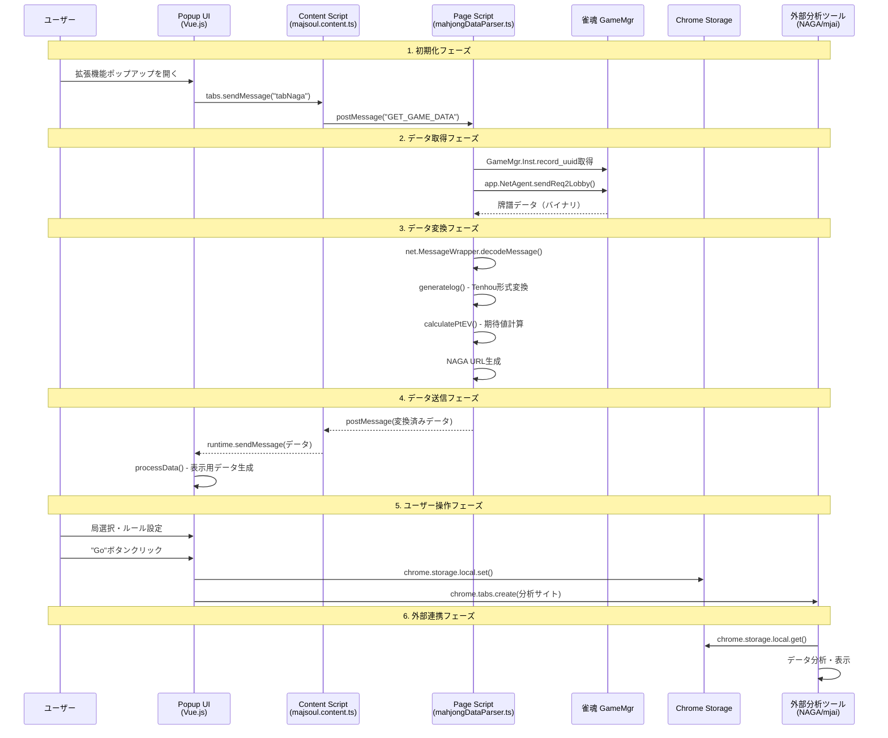
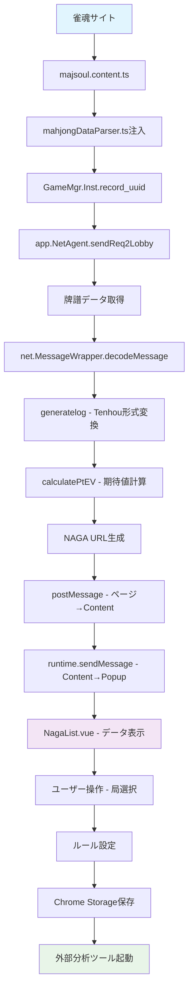

# CLAUDE.md

This file provides guidance to Claude Code (claude.ai/code) when working with code in this repository.

## ルール

- やりとりは日本語で行う
- 思考は英語で行う
- ハードコーディング禁止
- t-wadaのTDDを採用する
- Context7を使用して最新のドキュメントを参照する
- 動作確認は`chrome-mcp-server`を使用する

## プロジェクト概要

Mahjong Soul Review Supporter は、雀魂（じゃんたま）の牌譜レビューを支援するChrome/Edge拡張機能です。NAGAやmjai-reviewer（Akochan、Mortal）などのAI分析ツールと連携します。

## 開発コマンド

```bash
# 開発サーバー（自動リロード、ホットリロード）
npx wxt

# 本番ビルド（最適化済み）
npx wxt build

# ZIPファイル作成
npx wxt zip

# Lintチェック
npm run lint

# TypeScriptチェック
npm run typecheck

# テスト実行
npm test

# WXT準備（初回セットアップ、ビルド後に実行）
npm run prepare
```

## アーキテクチャ

### 主要技術スタック

- **WXT**: 現代的な拡張機能開発フレームワーク
- **Vue.js 3**: フロントエンドフレームワーク（Composition API）
- **Vite**: 高速ビルドツール（Webpack から移行）
- **TypeScript**: 型安全な開発環境
- **TailwindCSS**: スタイリング
- **Vitest**: テストフレームワーク
- **Manifest V3**: 拡張機能API

### ディレクトリ構造

- `entrypoints/`: WXTエントリーポイント
  - `background.ts`: サービスワーカー（拡張機能のバックグラウンド処理）
  - `majsoul.content.ts`: 雀魂サイトへの統合
  - `naga.content.ts`: NAGA分析ツール連携
  - `mjai.content.ts`: mjai-reviewer連携
  - `popup/`: 拡張機能ポップアップUI（Vue コンポーネント）
  - `options/`: オプションページ
- `components/`: Vue.jsコンポーネント
- `utils/`: ユーティリティ関数
- `src/utils/`: データ変換ロジック
- `public/_locales/`: 多言語対応（en、ja、zh_CN、zh_TW）
- `wxt.config.ts`: WXT設定ファイル

### 重要な実装詳細

1. **拡張機能の動作フロー**:
   - content scriptが雀魂ページに注入される
   - ゲームデータを取得してTenho形式に変換
   - popup UIから外部分析ツールへのリンクを提供

2. **データ保存**: Chrome Storage APIを使用

3. **開発時のホットリロード**: WXTが自動リロードとホットリロードを提供

### 技術的特徴

- **Node.js 20+**: 最新のNode.js環境で動作
- **Vitest**: テストフレームワーク設定完了（188テスト）
- **TypeScript**: 型安全な開発環境
- **WXT**: ファイルベースルーティングとオートインポート
- **ESLint**: Vue3とWebExtensions環境で設定済み

### パフォーマンス

- **ビルド時間**: Webpack失敗 → WXT 2.4秒（大幅改善）
- **開発体験**: ホットリロードとライブリロード対応
- **ファイルサイズ**: 4.2MB（最適化済み）

## 重要な実装ポイント

### WXTフレームワークの特徴

- **ファイルベースルーティング**: `entrypoints/`ディレクトリ構造でエントリーポイントを自動認識
- **オートインポート**: `utils/`、`components/`から自動import
- **Manifest V3対応**: Service Worker（background.ts）とContent Scripts
- **開発時ホットリロード**: ファイル変更時の自動リロード

### データフロー設計

拡張機能のデータ処理は、複数のコンテキスト間での安全で効率的な通信を実現する多段階プロセスです。

#### 全体的なデータフロー

1. **ページコンテキスト**（mahjongDataParser.ts）
   - 雀魂のGameMgrオブジェクトにアクセス
   - app.NetAgentを使用してゲーム記録を取得
   - 牌譜データをTenhou形式に変換
   - NAGA分析用のptEV（期待値）を計算

2. **Content Script**（majsoul.content.ts）
   - ページスクリプトの注入と管理
   - ページ⟷Content Script間のpostMessage通信
   - Content Script⟷Popup間のruntime.sendMessage通信
   - 10秒のタイムアウト制御による安全な非同期処理

3. **Popup UI**（Vue.js）
   - ユーザーインターフェースの提供
   - 局選択とルール設定機能
   - NAGA/mjai分析ツールへのデータ送信

#### 詳細なデータフロー

**1. 初期化フェーズ**
- background.tsがサービスワーカーとして起動
- 拡張機能インストール時に言語設定を初期化
- majsoul.content.tsが雀魂サイトに注入される

**2. データ取得フェーズ**
- PopupがContent Scriptに"tabNaga"/"tabMjai"メッセージを送信
- Content Scriptがページに"GET_GAME_DATA"メッセージを送信
- ページスクリプトがGameMgrから牌譜データを取得
- データをTenhou形式に変換し、ptEVを計算

**3. データ処理フェーズ**
- 変換されたデータがContent Scriptに返却
- Content ScriptがPopupにruntime.sendMessageでデータを送信
- PopupがVueコンポーネントでデータを表示・処理

**4. 外部連携フェーズ**
- ユーザーが局を選択しルールを設定
- 選択されたデータが外部分析ツール形式に変換
- Chrome Storage APIに保存後、新しいタブで分析サイトを開く

#### 技術的特徴

- **セキュリティ境界の管理**: ページコンテキストとContent Scriptの分離
- **非同期エラーハンドリング**: Promise-basedな実装でタイムアウト制御
- **データ整合性**: 複数段階での検証とエラー処理
- **パフォーマンス最適化**: 必要なデータのみを変換・送信

#### データフロー図





### テスト実行方法

```bash
# 全テスト実行
npm test

# テストファイル単体実行
npx vitest run tests/specific-test.test.js

# カバレッジ付きテスト
npm run test:coverage
```

## 開発環境セットアップ

### 初回セットアップ手順

```bash
# 依存関係のインストール
npm install

# WXTの初期化（型生成など）
npm run prepare

# 開発サーバー起動（ポート3000）
npx wxt
```

### 拡張機能のデバッグ方法

1. **開発サーバー起動**: `npx wxt`でポート3000で開発サーバーを起動
2. **拡張機能の読み込み**: Chrome/Edgeの開発者モードで`dist-wxt`フォルダを読み込み
3. **自動リロード**: ファイル変更時に自動でリロード（`Alt+Shift+Ext+R`）
4. **DevTools**: 拡張機能のコンソールでデバッグ
   - Popup: 拡張機能アイコンを右クリック→「デベロッパーツール」
   - Content Script: 対象サイトのDevToolsコンソール
   - Background: chrome://extensions/でサービスワーカーを検証

## 重要なファイル構成

- `wxt.config.ts`: WXT設定（ポート、マニフェスト、Vite設定）
- `entrypoints/background.ts`: サービスワーカー（拡張機能のバックグラウンド）
- `entrypoints/majsoul.content.ts`: メインのコンテンツスクリプト
- `utils/mahjongDataParser.ts`: 雀魂データ解析ロジック
- `public/_locales/`: 国際化ファイル（en、ja、zh_CN、zh_TW）
