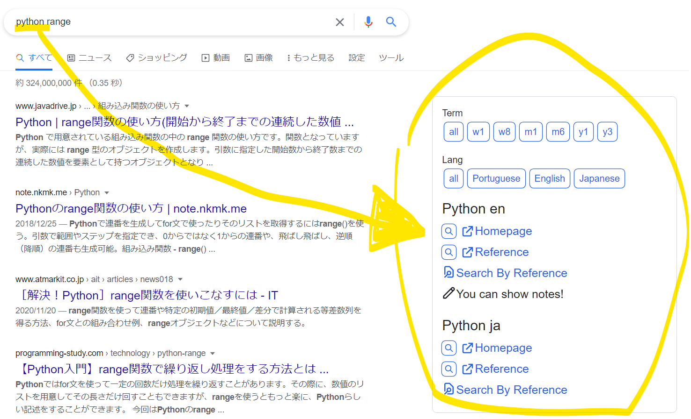
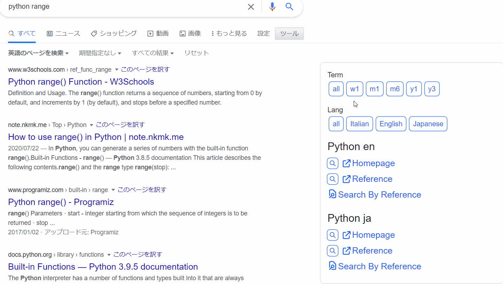
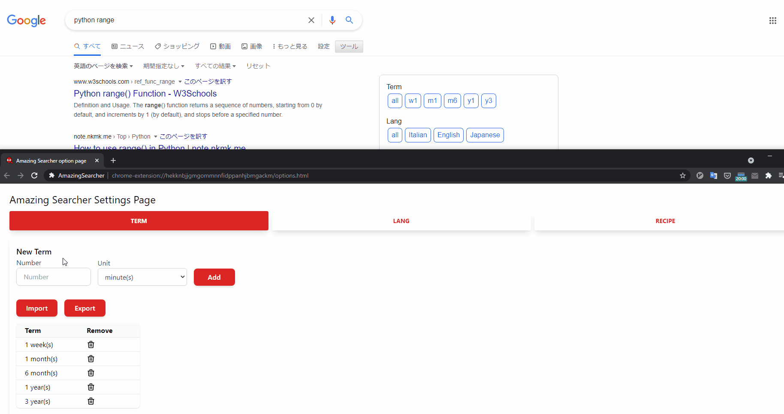
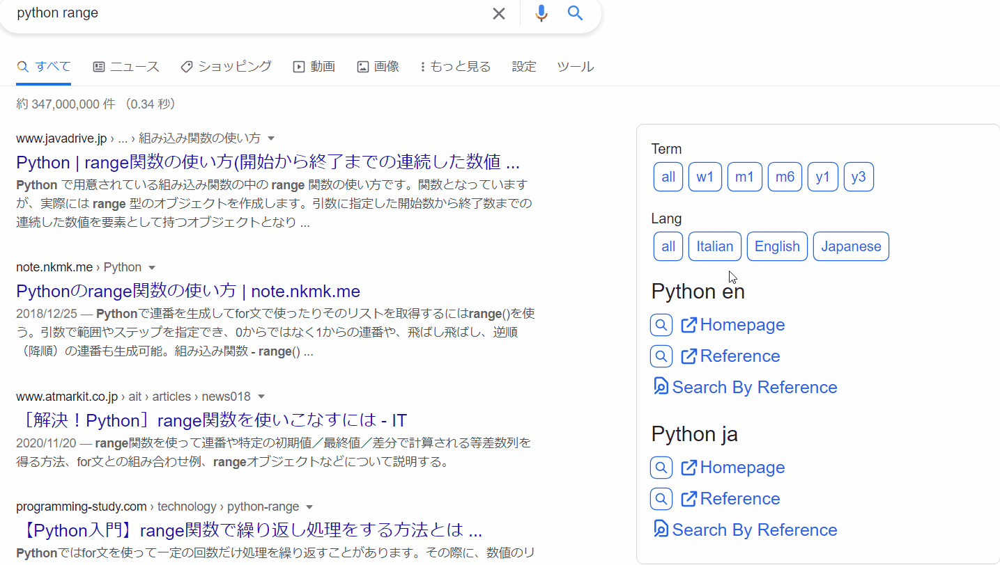
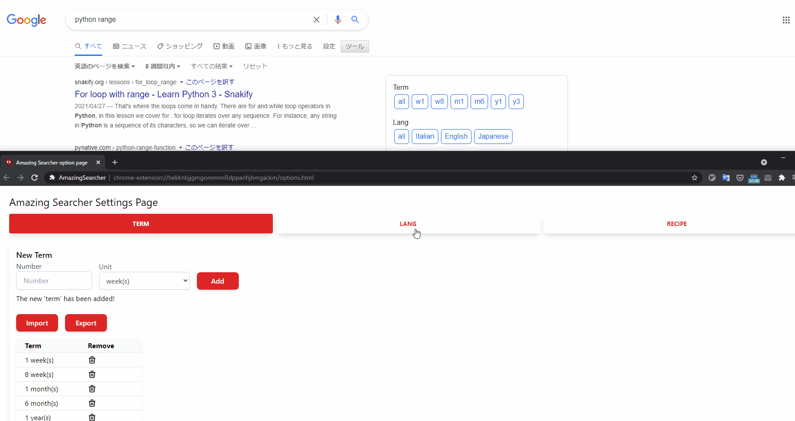
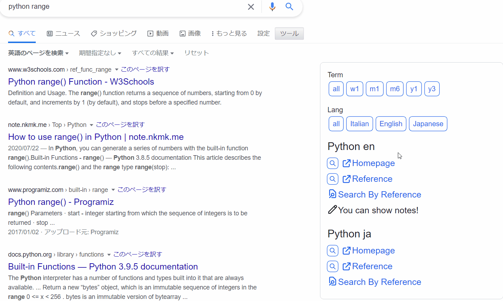

# Amazing Searcher
This is a Chrome Extension that add useful information to Google Search results

## Installation
Chrome Web Store link is [Here](https://chrome.google.com/webstore/detail/amazing-searcher/poheekmlppakdboaalpmhfpbmnefeokj)

日本語の記事は[こちら](https://zenn.dev/eetann/articles/2021-05-30-introduction-amazing-searcher)

## Features
There are three types of `Term` `Lang` `Recipe` that will be added to the Google search results.  
All three can be customized from the options page. You can access the options from the Extensions list.  

## `Term`
### Search Result
The `Term` will display a **restricted period link**.  

For example, if you click on `1w`, you can restrict search to within a week.  

The correspondence is as follows

|   | period |
|---|--------|
| n | minute |
| h | hour   |
| d | day    |
| w | week   |
| m | month  |
| y | year   |

If you click on `all`, you can revert to the full period (normal search).  

### Customize

The `TERM` tab of the options page has the following features  

* Add a new term from the `New Term`
* Delete by clicking the trash icon in the table
* Export in CSV format
* Import in CSV format
* Reset to default by clicking Reset button

The default is

* 1 week
* 1 month
* 6 months
* 1 year
* 3 years

The `minute` search may be used in combination with the `news` sectoin.  

## `Lang`
### Search Result
The `Lang` will display a **restricted lang link**.

For example, if you click on `Japanese`, you can restrict search to Japanese.  

If you click on `all`, you can revert to all languages (normal search).  

### Customize

The `LANG` tab of the options page has the following features  

* Add a new language from the `New Lang`
* Delete by clicking the trash icon in the table
* Reset to default by clicking Reset button

The default is

* English
* Japanese

There is no import & export feature, because I don't think `Lang` is customized often.  

### Search Result
In addition to `Term` and `Lang`, you can also **display home pages and references of things that match your search results**. I named this `Recipe` (please ignore my naming sense).
↓ This is a long GIF.

The components of `recipe` are as follows

|           | Description                                                                                                  |
| --------- | ----------------------------------------------------                                                         |
| Target    | Things related to `Recipe`   In the searc results, `Recipe` with the same Target will be grouped together |
| Keyword   | The regular expression you set for Keyword will display recipes that match you search                        |
| Kind      | String                                                                                                       |
| URL       | URL                                                                                                          |

There are four main functions related to `Recipe`  

* Display links that match your search
* Display of `site restricted search` links using the search
* Display links to search within the site using the search
* Display notes for search

### Show links and restrict site search
Displays a link to a Google search that restricts the target to the site of the matching `Recipe`.  

For example, register the following `Recipe` and do a Google search for `python range`.  

|           | Example                    |
| --------- | -                          |
| Target    | `Python en`                |
| Keyword   | `python\|pyてょn`          |
| Kind      | `Reference`                |
| URL       | `https://docs.python.org/` |

This will display the string `Reference` with a link `https://docs.python.org/` next to the search result with an icon.  
You will also see a magnifying glass icon next to it. Clicking on this icon will display **Google search with `site:docs.python.org range` as your search**.  

### Search within the site
If the URL contains `%s`, the link to search within the site will be displayed.

For example, register the following `Recipe` and do a Google search for `python range`.  
|           | Example                                      |
| --------- | -                                            |
| Target    | `Python en`                                  |
| Keyword   | `python\|pyてょn`                            |
| Kind      | `Search By Reference`                        |
| URL       | `https://docs.python.org/3/search.html?q=%s` |

This will display the string `Search By Reference` with a link `https://docs.python.org/3/search.html?q=range` with an icon.  
Clicking on this icon will do a **search on the site specified in `Recipe` with the search word `range`**.  

### Notes
If you specify `Memo` for `Kind`, a string will be displayed instead of a link.  
It is useful to show the office documentation if it is provided as a command.  

### Display order
The order in which recipes are displayed depends on the string you specify for `kind` or `URL`

1. recipes whose Kind is `Homepage`
2. recipes whose Kind is `Reference`
3. recipes that do not fall into the above or below categories
4. recipes that contain `%s` in the URL
5. recipes whose Kind is `Memo`

### Customize

The `RECIPE` tab of the options page has the following features  

* Add a new Recipe from the `New Recipe`
* Delete by clicking the trash icon in the table
* Export in CSV format
* Import in CSV format
* Reset to default by clicking Reset button

`,` are not allowed the values for csv import.  

In particular, by setting up a lot of `Recipe`, you can greatly reduce the time it takes to get to the information you want!  
The default `Recipe` is quite biased. You are welcome to customize it yourself in `RECIPE` tab.

## Author
[@eetann092](https://twitter.com/eetann092)  
