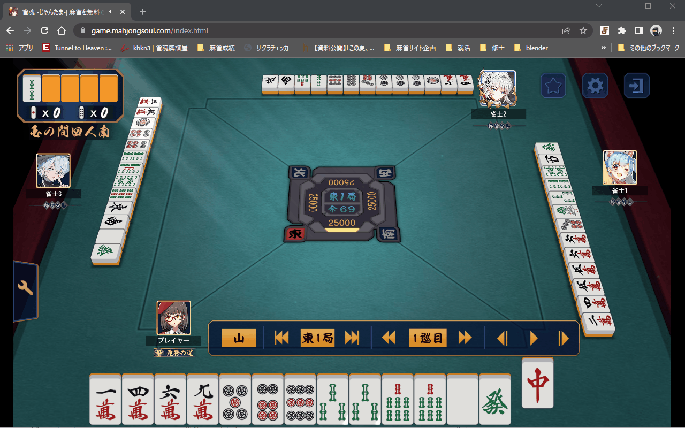

# Mahjong Soul Review Supporter

This extension retrieves information and automatically transfers to the screen to review the paihu of Mahjong Soul.

## Features

* Retrieves paihu data and displays it on the screen.
* Converts paihu data to Tempo format and transfers it to NAGA's custom paihu review screen.
* Transfers paihu data to [mjai-reviewer](https://mjai.ekyu.moe/) (Akochan, Mortal).

## Installation

Chrome Web Store link is [Here](https://chrome.google.com/webstore/detail/mahjongsoul-review-suppor/kdmfnkdgpialmejpgflfllkjakolamcc)

Edge Web Store link is [Here](https://microsoftedge.microsoft.com/addons/detail/jopdfhmfehndjpnjjidmkkmjmkaebodb)

日本語の記事は[こちら](https://modern-jan.com/2022/07/19/mjrs/)

## Supported Languages

* `en` English
* `zh` Chinese
* `ja` Japanese

## Author

[@kbkn_p](https://twitter.com/kbkn_p)  
Collaborator [たまば](https://twitter.com/utm_tmb)

## 既知の制限

### 同巡に同一牌が複数回切られた場合のポンの再生ずれ (Issue #22)

同一プレイヤーが同じ牌を（間に他家の鳴きを挟んで）連続して手出しし、その後の1枚が
ポンされた対局では、天鳳/6形式（プレイヤー別カラム形式）の仕様上「どちらの打牌が
鳴かれたか」を表現できません（上流 [tensoul#14](https://github.com/Equim-chan/tensoul/issues/14)
で形式固有の制限として確認済み）。このため天鳳ビューアや NAGA では該当局の進行が
実際と異なって再生されることがあります。変換された牌譜データ自体は正しく、
[mjai-reviewer](https://github.com/Equim-chan/mjai-reviewer)（Mortal）はバックトラッキングで
正しく解釈するため、レビュー結果には影響しません。

## Credits

This project includes code and concepts from:

* [雀魂の牌譜をNAGAに解析させる－完全版－ - ねことくまとへび](https://lions.blue/07813) by ちぃといつ (December 12, 2021) - Licensed under Apache License 2.0
  * The actual reference in this project is [NagaList.vue](src/popup/NagaList.vue)
* mjai-reviewer : [Github Equim-chan/mjai-reviewer](https://github.com/Equim-chan/mjai-reviewer)
  * Apache-2.0 Using `downloadlogs script`
  * The actual reference in this project is [dd.js](src/content-scripts/dd.js)
* tensoul : [Github Equim-chan/tensoul](https://github.com/Equim-chan/tensoul)
  * MIT - Referenced for the Mahjong Soul CDN version resolution method
* MajsoulMax : [Github Avenshy/MajsoulMax](https://github.com/Avenshy/MajsoulMax)
  * GPL-3.0 - Referenced for the liqi WebSocket frame structure (no code copied)

## License

[Apache-2.0](https://github.com/Wabu-K/MahjongSoul-review-supporter/blob/develop/LICENSE)

## Thanks

* NAGA by DWANGO : [麻雀AI NAGA](https://naga.dmv.nico/naga_report/top/)
* mjai-reviewer　: [Github Equim-chan/mjai-reviewer](https://github.com/Equim-chan/mjai-reviewer)
  * Using `downloadlogs script`
* Akochan : [Github critter-mj/akochan](https://github.com/critter-mj/akochan)
* Mortal : [Github Equim-chan/Mortal](https://github.com/Equim-chan/Mortal)
* Amazing-searcher : [Github eetann/amazing-searcher](https://github.com/eetann/amazing-searcher)
  * I used this link Vue.js and auto-reloading development environment as a reference
